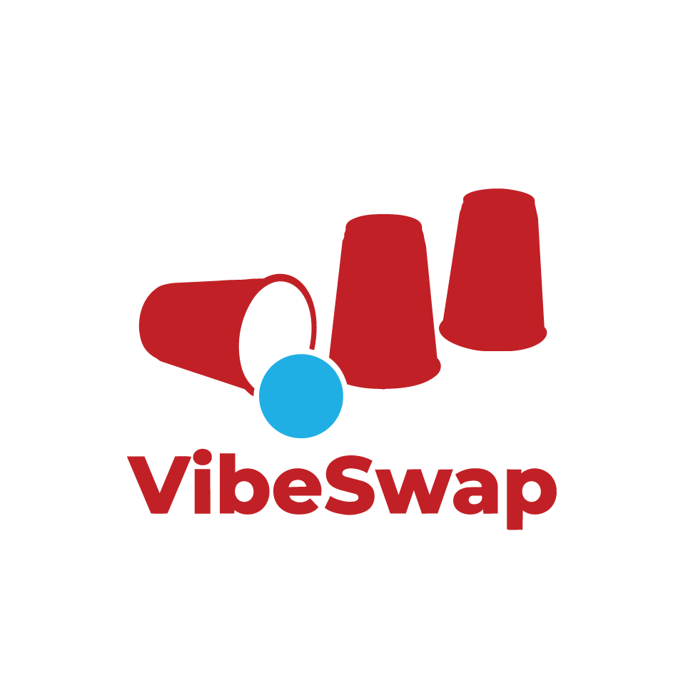

# VibeSwap

<p align="center">
  
</p>

VibeSwap is a small, lightweight, and performant account and token switcher for AI vibe coding harnesses (Cursor, Windsurf, Claude Code, etc.) and coding CLIs (Codex, Antigravity/agy). 

It allows you to switch between accounts/tokens instantly while keeping your workspace sessions, terminal states, and editor layouts intact.

## Features

*   **Zero-Dependency Compilation**: Built in Go using the Charm Bubble Tea framework. Starts up in <10ms with a tiny memory footprint.
*   **Dual Mode**: Supports a modern interactive terminal user interface (TUI) and non-interactive command-line interface (CLI) commands.
*   **Target Types**:
    *   `file`: Replaces complete session files (e.g., Codex CLI `auth.json`) and can also capture a related macOS Keychain item for tools that split auth across files and Keychain.
    *   `json_key`: Replaces specific keys in a larger JSON configuration file (e.g., Claude Desktop App `oauth:tokenCache`).
    *   `wrapped_dir`: Dynamically wraps CLI commands to isolate configuration directories via environment variables (e.g., Claude Code CLI using `CLAUDE_CONFIG_DIR`) while switching the tool's live credentials.
    *   `keychain`: Swaps macOS Keychain generic password entries.
    *   `sqlite` *(Architecture designed, stubbed for future implementation)*: Swaps rows inside VS Code-based state databases (e.g., Cursor, Windsurf).
*   **Flexible Swapping**: Supports individual target swapping or global profile swapping (e.g., switching all active targets to a "work" profile in a single command).

## Installation

Ensure you have Go installed, then clone the repository and build:

```bash
git clone https://github.com/yourusername/vibe-swap.git
cd vibe-swap
go build -o vibeswap cmd/main.go
```

Move the compiled binary to your path (e.g. `/usr/local/bin/vibeswap`).

## Configuration

VibeSwap is fully extensible. You can customize targets in `~/.config/vibeswap/config.json`. The default configuration is created automatically on the first run.

```json
{
  "targets": {
    "codex": {
      "name": "Codex CLI",
      "type": "file",
      "path": "~/.codex/auth.json"
    },
    "claude_cli": {
      "name": "Claude Code CLI",
      "type": "wrapped_dir",
      "path": "~/.claude",
      "env_var": "CLAUDE_CONFIG_DIR",
      "binary": "claude",
      "service": "Claude Code-credentials"
    },
    "claude_desktop": {
      "name": "Claude Desktop App",
      "type": "json_key",
      "path": "~/Library/Application Support/Claude/config.json",
      "key": "oauth:tokenCache"
    },
    "agy": {
      "name": "Antigravity CLI (agy)",
      "type": "file",
      "service": "gemini",
      "account": "antigravity",
      "paths": [
        "~/.gemini/antigravity-cli/antigravity-oauth-token",
        "~/.gemini/antigravity-cli/settings.json",
        "~/.gemini/oauth_creds.json",
        "~/.gemini/google_accounts.json"
      ]
    }
  }
}
```

### Notes on Claude Code and agy

Claude Code uses `CLAUDE_CONFIG_DIR` for profile-specific local state such as settings, cache, projects, and history. On macOS, Claude Code reads OAuth credentials from the live Keychain item `Claude Code-credentials`, so VibeSwap stores a credential snapshot in each profile and writes the selected snapshot back to that live Keychain item when switching. `vibeswap switch claude_cli <profile>` only restores the selected saved snapshot; `vibeswap save claude_cli <profile>` is the operation that captures the current live Claude credential into that profile.

Antigravity/agy on macOS can authenticate through the `gemini` Keychain service with account `antigravity`, while also writing settings and compatibility files under `~/.gemini`. The default agy target captures both the configured files and the Keychain item. Saving a profile with an existing name overwrites that profile.

## Usage

### Interactive TUI

Simply run `vibeswap` to launch the Bubble Tea user interface:

```bash
vibeswap
```

*   Use `Up`/`Down` or `j`/`k` to navigate.
*   Press `Tab` to switch focus between the Targets sidebar and the Profiles list.
*   Press `s` to save the active credentials of the highlighted target as a new profile.
*   Press `Enter` to switch the highlighted target to the highlighted profile.
*   Press `d` to delete the highlighted profile.
*   Press `a` to apply the highlighted profile globally to all targets.
*   Press `q` or `Ctrl+C` to quit.

### Non-Interactive CLI

*   **List targets and profiles**:
    ```bash
    vibeswap list
    ```
*   **Save active credentials to a profile**:
    ```bash
    vibeswap save <target_id> <profile_name>
    ```
*   **Switch a target to a profile**:
    ```bash
    vibeswap switch <target_id> <profile_name>
    ```
*   **Global switch all targets to a profile**:
    ```bash
    vibeswap profile <profile_name>
    ```
*   **Delete a profile**:
    ```bash
    vibeswap delete <target_id> <profile_name>
    ```
*   **Install/update shell integration wrapper**:
    ```bash
    vibeswap shell-install
    ```
*   **Uninstall shell integration wrapper**:
    ```bash
    vibeswap shell-uninstall
    ```

## Security

Profile backup configurations and tokens are stored in `~/.config/vibeswap/profiles/` with strict user-only read/write permissions (`0700` for directories, `0600` for files).
