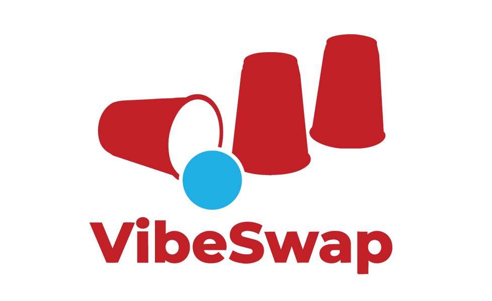

# VibeSwap

<p align="center">
  
</p>

VibeSwap is a small, lightweight, and performant account and token switcher for AI coding CLIs and apps. The default targets currently cover Codex CLI, Claude Code CLI, Claude Desktop, and Antigravity/agy.

It allows you to switch between accounts/tokens while preserving each tool's local configuration and workspace state where the tool supports it.

## Features

*   **Zero-Dependency Compilation**: Built in Go using the Charm Bubble Tea framework. Starts up in <10ms with a tiny memory footprint.
*   **Dual Mode**: Supports a modern interactive terminal user interface (TUI) and non-interactive command-line interface (CLI) commands.
*   **Target Types**:
    *   `file`: Replaces complete session files (e.g., Codex CLI `auth.json`) and can also capture a related macOS Keychain item for tools that split auth across files and Keychain.
    *   `json_key`: Replaces specific keys in a larger JSON configuration file (e.g., Claude Desktop App `oauth:tokenCache`).
    *   `wrapped_dir`: Dynamically wraps CLI commands to isolate configuration directories via environment variables (e.g., Claude Code CLI using `CLAUDE_CONFIG_DIR`) while switching the tool's live credentials.
    *   `keychain`: Swaps macOS Keychain generic password entries.
    *   `electron_profile`: Swaps selected Electron/Chromium desktop app state files plus matching macOS Safe Storage Keychain entries.
    *   `sqlite` *(Architecture designed, stubbed for future implementation)*: Reserved for tools that store credentials in local SQLite state.
*   **Flexible Swapping**: Supports individual target swapping or global profile swapping (e.g., switching all active targets to a "work" profile in a single command).

## Installation

Ensure you have Go installed, then clone the repository and build:

```bash
git clone https://github.com/yourusername/vibe-swap.git
cd vibe-swap
go build -o vibeswap cmd/main.go
```

Move the compiled binary to your path (e.g. `/usr/local/bin/vibeswap`).

## Configuration

VibeSwap is fully extensible. You can customize targets in `~/.config/vibeswap/config.json`. The default configuration is created automatically on the first run.

```json
{
  "targets": {
    "codex": {
      "name": "Codex CLI",
      "type": "file",
      "path": "~/.codex/auth.json"
    },
    "claude_cli": {
      "name": "Claude Code CLI",
      "type": "wrapped_dir",
      "path": "~/.claude",
      "env_var": "CLAUDE_CONFIG_DIR",
      "binary": "claude",
      "service": "Claude Code-credentials"
    },
    "claude_desktop": {
      "name": "Claude Desktop App",
      "type": "electron_profile",
      "path": "~/Library/Application Support/Claude",
      "paths": [
        "~/Library/Application Support/Claude/config.json",
        "~/Library/Application Support/Claude/Cookies",
        "~/Library/Application Support/Claude/Cookies-journal",
        "~/Library/Application Support/Claude/DIPS",
        "~/Library/Application Support/Claude/DIPS-wal",
        "~/Library/Application Support/Claude/Local State",
        "~/Library/Application Support/Claude/Preferences",
        "~/Library/Application Support/Claude/ant-did",
        "~/Library/Application Support/Claude/Network Persistent State",
        "~/Library/Application Support/Claude/fcache",
        "~/Library/Application Support/Claude/Local Storage",
        "~/Library/Application Support/Claude/Session Storage",
        "~/Library/Application Support/Claude/IndexedDB"
      ],
      "processes": [
        "Claude",
        "Claude Helper",
        "Claude Helper (Renderer)",
        "Claude Helper (GPU)",
        "Claude Helper (Plugin)"
      ],
      "process_patterns": [
        "--user-data-dir=~/Library/Application Support/Claude",
        "Claude.app/Contents/MacOS/Claude"
      ],
      "keychain_items": [
        {
          "service": "Claude Safe Storage",
          "account": "Claude Key"
        }
      ]
    },
    "codex_desktop": {
      "name": "Codex Desktop App",
      "type": "electron_profile",
      "path": "~/Library/Application Support/Codex",
      "paths": [
        "~/Library/Application Support/Codex/Cookies",
        "~/Library/Application Support/Codex/Cookies-journal",
        "~/Library/Application Support/Codex/DIPS",
        "~/Library/Application Support/Codex/DIPS-wal",
        "~/Library/Application Support/Codex/Local State",
        "~/Library/Application Support/Codex/Local Storage",
        "~/Library/Application Support/Codex/Network Persistent State",
        "~/Library/Application Support/Codex/Preferences",
        "~/Library/Application Support/Codex/Session Storage",
        "~/Library/Application Support/Codex/Default/Cookies",
        "~/Library/Application Support/Codex/Default/Cookies-journal",
        "~/Library/Application Support/Codex/Default/DIPS",
        "~/Library/Application Support/Codex/Default/DIPS-wal",
        "~/Library/Application Support/Codex/Default/Local Storage",
        "~/Library/Application Support/Codex/Default/Network Persistent State",
        "~/Library/Application Support/Codex/Default/Preferences",
        "~/Library/Application Support/Codex/Partitions/codex-browser-app/Cookies",
        "~/Library/Application Support/Codex/Partitions/codex-browser-app/Cookies-journal",
        "~/Library/Application Support/Codex/Partitions/codex-browser-app/DIPS",
        "~/Library/Application Support/Codex/Partitions/codex-browser-app/Local Storage",
        "~/Library/Application Support/Codex/Partitions/codex-browser-app/Network Persistent State",
        "~/Library/Application Support/Codex/Partitions/codex-browser-app/Preferences",
        "~/Library/Application Support/OpenAI/Codex"
      ],
      "processes": [
        "Codex",
        "Codex Helper",
        "Codex Helper (Renderer)",
        "Codex Helper (GPU)",
        "Codex Helper (Plugin)"
      ],
      "process_patterns": [
        "--user-data-dir=~/Library/Application Support/Codex",
        "Codex.app/Contents/MacOS/Codex"
      ],
      "keychain_items": [
        {
          "service": "Codex Safe Storage",
          "account": "Codex"
        },
        {
          "service": "Codex Safe Storage",
          "account": "Codex Key"
        }
      ]
    },
    "agy": {
      "name": "Antigravity CLI (agy)",
      "type": "file",
      "service": "gemini",
      "account": "antigravity",
      "paths": [
        "~/.gemini/antigravity-cli/antigravity-oauth-token",
        "~/.gemini/antigravity-cli/settings.json",
        "~/.gemini/oauth_creds.json",
        "~/.gemini/google_accounts.json"
      ]
    }
  }
}
```

### Notes on Claude Code, desktop apps, and agy

Claude Code uses `CLAUDE_CONFIG_DIR` for profile-specific local state such as settings, cache, projects, and history. On macOS, Claude Code reads OAuth credentials from the live Keychain service `Claude Code-credentials` under the current macOS username account, so VibeSwap stores a credential snapshot in each profile and writes the selected snapshot back to that live Keychain item when switching. This should work across other macOS users and computers because VibeSwap resolves the Keychain account from the current `$USER` environment variable instead of hard-coding a local username.

`vibeswap switch claude_cli <profile>` only restores the selected saved snapshot; `vibeswap save claude_cli <profile>` is the operation that captures the current live Claude credential into that profile. If a profile was saved with an older VibeSwap build that used the `default` Keychain account, re-login once with the intended Claude account and run `vibeswap save claude_cli <profile>` to refresh that profile. Profiles with identical `.vibeswap_keychain.json` files contain the same Claude credential and will not switch accounts until one of them is re-saved.

Antigravity/agy on macOS can authenticate through the `gemini` Keychain service with account `antigravity`, while also writing settings and compatibility files under `~/.gemini`. The default agy target captures both the configured files and the Keychain item. Saving a profile with an existing name overwrites that profile.

Claude Desktop and Codex Desktop use Electron/Chromium app state on macOS. Their cookies and local storage depend on app-specific Safe Storage secrets in Keychain, so VibeSwap's `electron_profile` targets save both selected Application Support files and matching Keychain items. The Claude Desktop target tracks the same broad session items used by recent June 2026 Claude Desktop switchers, including cookie journals, `DIPS`, `ant-did`, `Network Persistent State`, `fcache`, `Local Storage`, `Session Storage`, and `IndexedDB`.

Quit the desktop app before saving or switching; VibeSwap refuses to operate while configured desktop processes are running to avoid copying live SQLite/session files. In the TUI, if VibeSwap can identify a blocking desktop process by its Electron `--user-data-dir` or app bundle executable path, it asks whether to close the desktop app and retry. Existing desktop profiles saved before these tracked paths were added should be re-saved while the intended account is active.

## Usage

### Interactive TUI

Simply run `vibeswap` to launch the Bubble Tea user interface:

```bash
vibeswap
```

*   Use `Up`/`Down` or `j`/`k` to navigate.
*   Press `Tab` to switch focus between the Targets sidebar and the Profiles list.
*   Press `s` to save the active credentials of the highlighted target as a new profile.
*   Press `Enter` to switch the highlighted target to the highlighted profile.
*   Press `r` to rename the highlighted profile.
*   Press `d` to delete the highlighted profile.
*   Press `a` to apply the highlighted profile globally to all targets.
*   Press `q` or `Ctrl+C` to quit.

### Non-Interactive CLI

*   **List targets and profiles**:
    ```bash
    vibeswap list
    ```
*   **Save active credentials to a profile**:
    ```bash
    vibeswap save <target_id> <profile_name>
    ```
*   **Switch a target to a profile**:
    ```bash
    vibeswap switch <target_id> <profile_name>
    ```
*   **Global switch all targets to a profile**:
    ```bash
    vibeswap profile <profile_name>
    ```
*   **Delete a profile**:
    ```bash
    vibeswap delete <target_id> <profile_name>
    ```
*   **Rename a profile**:
    ```bash
    vibeswap rename <target_id> <old_profile_name> <new_profile_name>
    ```
*   **Install/update shell integration wrapper**:
    ```bash
    vibeswap shell-install
    ```
*   **Uninstall shell integration wrapper**:
    ```bash
    vibeswap shell-uninstall
    ```

## Security

Profile backup configurations and tokens are stored in `~/.config/vibeswap/profiles/` with strict user-only read/write permissions (`0700` for directories, `0600` for files).
